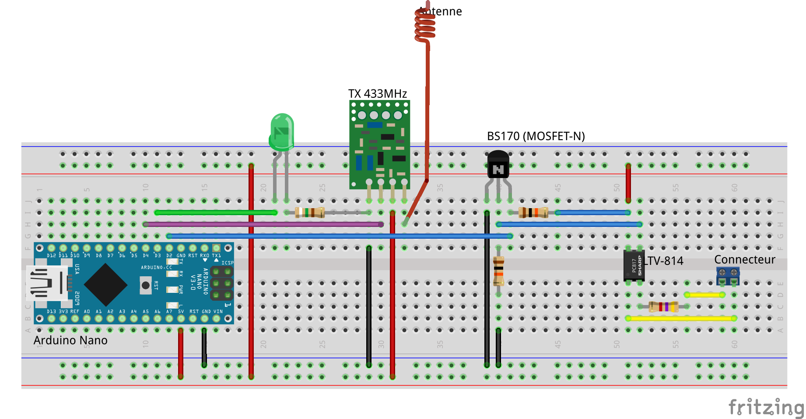

# arduino-teleinfo-edf

## Liste des composants

- Arduino Nano
- 1 module radio émetteur 433 MHz avec antenne
- 1 connecteur à vis 2 pôles
- 1 optocoupleur (LTV-814) 
- 2 resistances 10 kOhm
- 1 resistance 4,7 kOhm
- 1 resistance 150 Ohm
- 1 MOSFET-N (BS170)
- 1 LED verte

## Prototypage

## Références

- https://github.com/Sirus10/Arduino/blob/master/teleinfo_rf.ino

- https://domotique.web2diz.net/teleinfo-edf-arduino-sans-fil-avec-rfxcom/
- http://www.domotique-info.fr/2014/05/recuperer-teleinformation-arduino/
- http://hallard.me/pitinfov12/ 

- https://sandervandevelde.wordpress.com/2016/12/27/building-a-door-switch-using-domoticz-x10rf-and-arduino/
- https://github.com/pyrou/X10RF-Arduino

- http://connectingstuff.net/blog/encodage-protocoles-oregon-scientific-sur-arduino/
- https://github.com/onlinux/OWL-CM180
